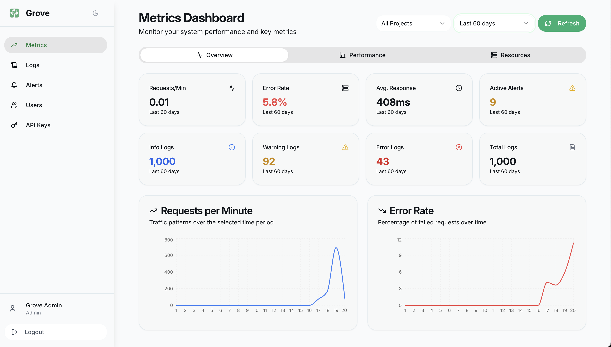
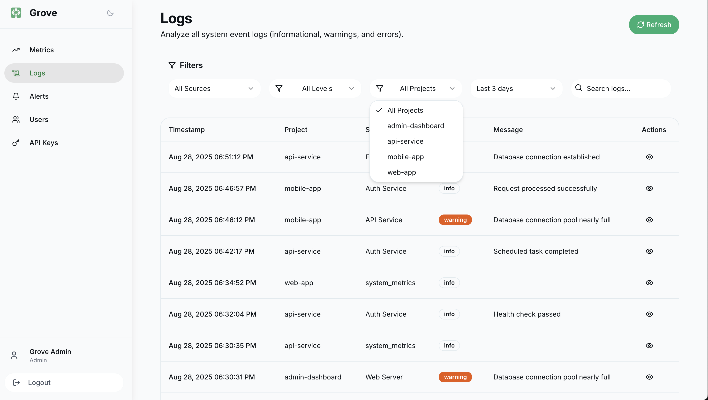

<div style="max-width: 700px; margin: 0 auto; text-align: center;">
   
<h1>Grove: Log Dashboard & Transport System</h1>
</div>

[](https://github.com/kimolalekan/grove/actions/workflows/build.yml)




---

## Table of Contents
1. [Introduction](#introduction)
2. [Features](#features)
3. [Installation](#installation)
5. [Configuration](#configuration)
6. [Dashboard Usage](#dashboard-usage)
7. [Troubleshooting](#troubleshooting)
8. [Contributing](#contributing)

---

## Introduction
**Grove** is a simple log management (multiple platforms) dashboard designed to aggregate, search, and visualize logs from various sources like Apache, Nginx, system logs, PM2, Laravel, and custom logs. It uses **React** for the frontend, **Express** for the backend, and **Meilisearch** for fast log indexing and search.

---

## Features
- **Real-time Log Aggregation**: Collect logs from multiple sources.
- **Fast Search**: Powered by Meilisearch for instant log retrieval.
- **Customizable Dashboard**: Filter logs by source, time range, and keywords.
- **Log Transport**: Bash scripts and systemd services for log collection.
- **User-friendly UI**: Dark theme, interactive graphs, and log previews.

---


## Installation

### Prerequisites
- Node.js (v20+)
- Meilisearch (v1.0+)
- Bash (for log transport)
- systemd (for log transport service)

### Steps
1. **Clone the Repository**:
   ```bash
   git clone https://github.com/your-repo/grove.git
   cd grove
   ```

2. **Install Dependencies**:
   ```bash
   yarn install
   ```

3. **Set Up Meilisearch**:
   ```bash
   curl -L https://install.meilisearch.com | sh
   ./meilisearch --master-key="YOUR_MASTER_KEY"
   ```

4. **Configure Environment**:
   Create a `.env` file:
   - Copy

5. **For Development**:
   ```bash
   yarn dev
   ```

6. **For Production**:
   ```bash
   yarn production
   yarn production:restart
   ```

## Configuration

### Meilisearch
- Update the `MEILI_URL` and `MEILI_API_KEY` in `.env`.
- Configure Meilisearch indexes for each log type (e.g., `apache`, `nginx`).

### Log Sources
- Copy [pipeline/setup.sh](/pipeline/setup.sh) and run on the server you have the logs.
- Copy [pipeline/grove.sh](/pipeline/grove.sh) and paste inside `/etc/grove/grove.sh`

### Log Transport
```sh
sudo systemctl daemon-reload
sudo systemctl enable grove
sudo systemctl start grove
```


## Dashboard Usage

### Accessing the Dashboard
- Open `http://localhost:3211` in your browser.

### Features
- **Search**: Use the search bar to find logs by keyword.
- **Filters**: Filter logs by source (e.g., Apache, Nginx) or time range.
- **Graphs**: Visualize log trends over time.
- **Log Preview**: Click on a log entry to see details.

---


## Troubleshooting

### Common Issues
- **Meilisearch Connection**: Ensure Meilisearch is running and the API key is correct.
- **Grove Service**: Check systemd status with `systemctl status grove.service`.
- **Log Transport**: Check Grove logs with `tail -f /var/log/grove.log`.
- **Dashboard Errors**: Verify Grove frontend is running on the correct port.

---

## Contributing
1. Fork the repository.
2. Create a feature branch.
3. Submit a pull request.

---
